1、表格

| 这个作业属于哪个课程 | [信安1912-软件工程 (广东工业大学 - 计算机学院)](https://edu.cnblogs.com/campus/gdgy/InformationSecurity1912-Softwareengineering/) |
| -------------------- | ------------------------------------------------------------ |
| 这个作业要求在哪里   | [个人项目作业](https://edu.cnblogs.com/campus/gdgy/InformationSecurity1912-Softwareengineering/homework/12146) |
| 这个作业的目标       | [编程]()                                                     |

2、计算模块接口的设计与实现过程

想要算出第二篇论文是否抄袭了第一篇论文，并且计算出抄袭的程度，试着写一个程序来实现，上网搜资料后知道，可以用这样的一个方法：把论文变成一种叫做词嵌入的格式，然后再用神经网络再把词嵌入变成特征向量，但是用了很多次神经网络之后，向量就会变得太大太复杂，所以用几次之后就要简化一次特征向量，经过几轮重复之后，就可以用计算两个向量的相似度，也就是题目要的抄袭程度，重复率

流程图

实现过程

按照下面这样的命令依次输入和回车，就可以算出老师给的五篇论文的重复率

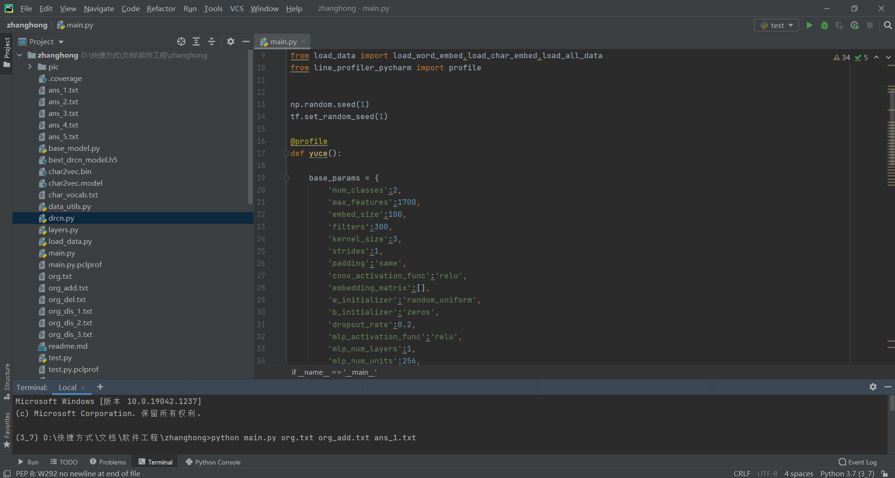

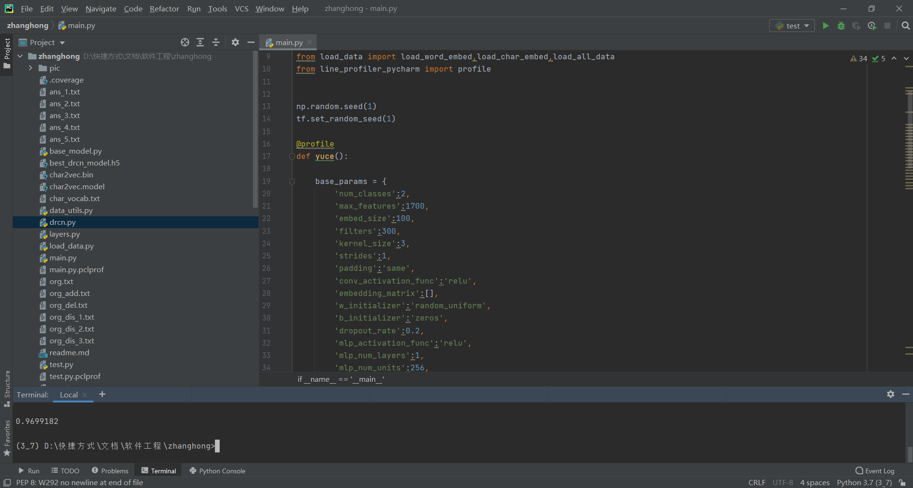

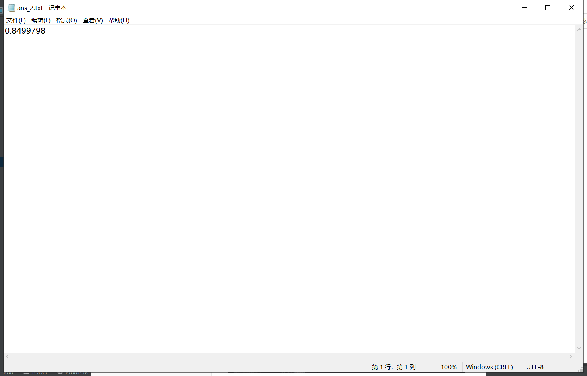

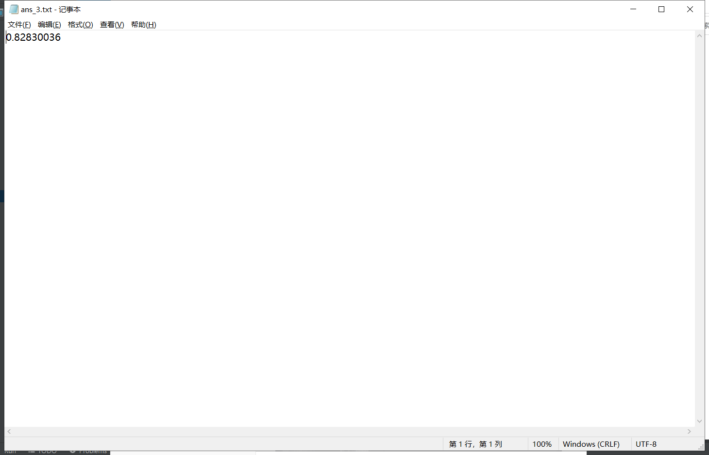

3、计算模块接口部分的性能改进

性能分析

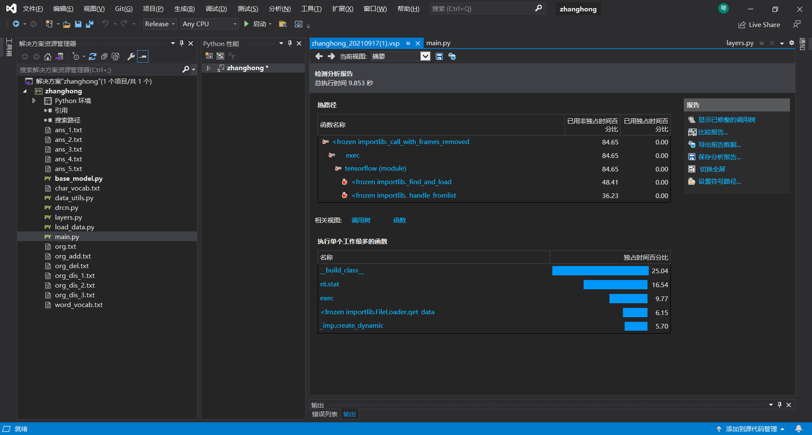

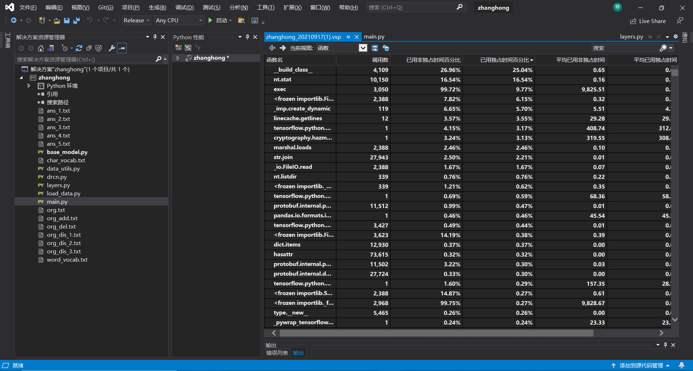

消耗最大的函数

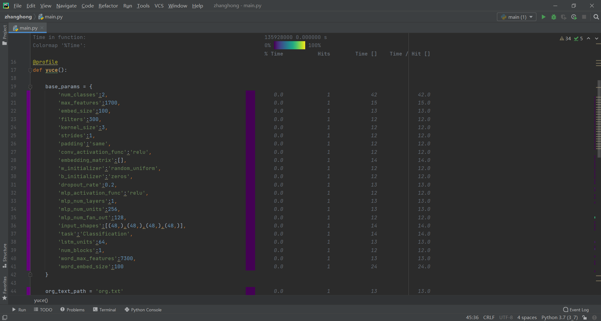

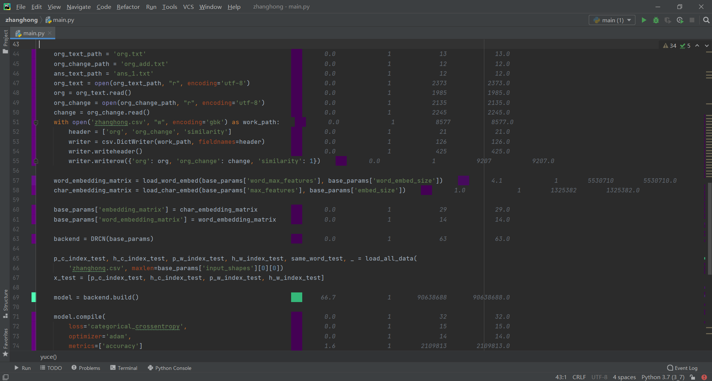

4、计算模块部分单元测试展示

输出覆盖率

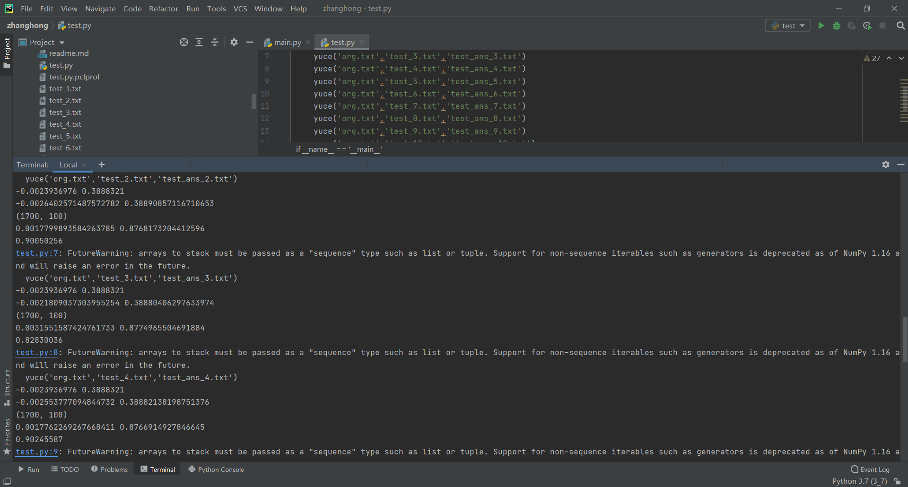

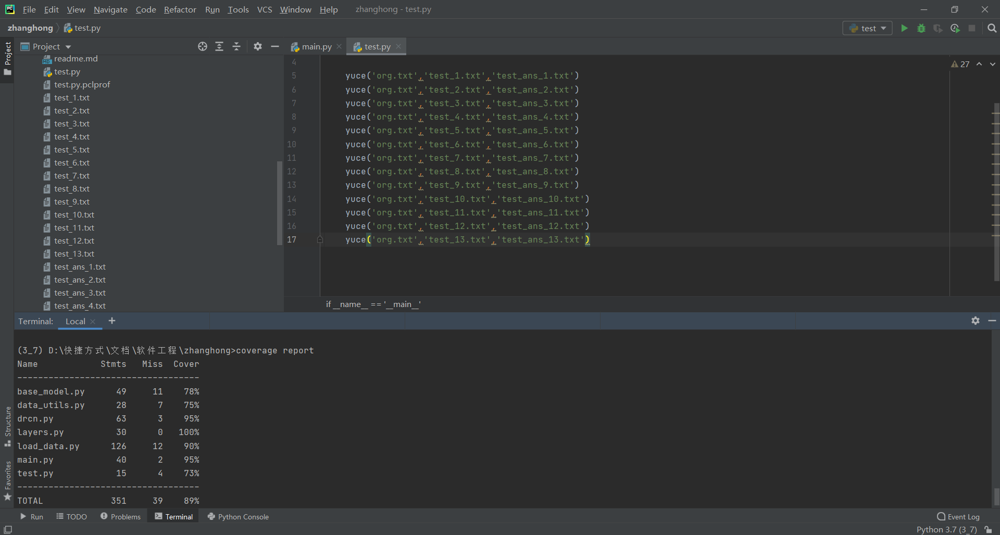

5、计算模块部分异常处理说明

如果文件名输入错了，就会报错说没有该文件存在，把文件名确认一次就好了

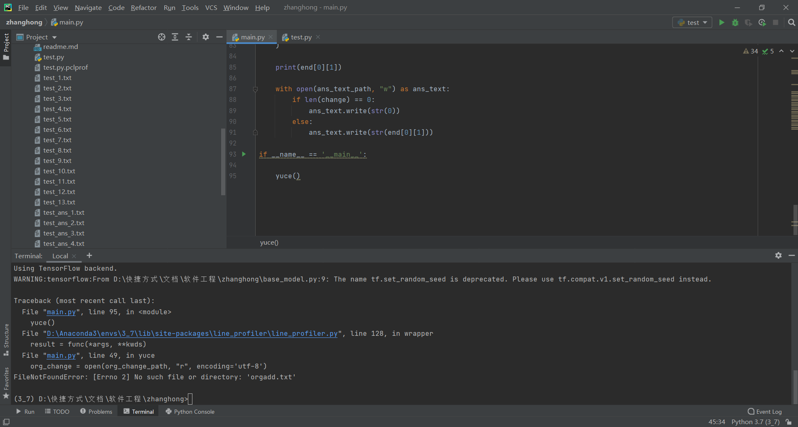

6、PSP表格

